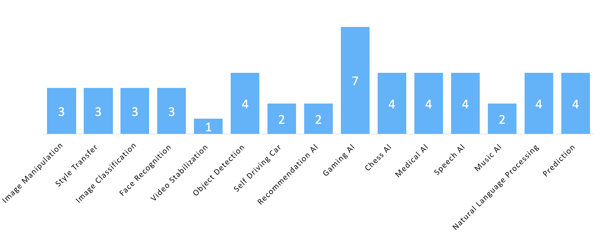

# Learn to Build a Machine Learning Application from Top Articles

</a>

For Jan-Dec 2017, we compared nearly 20,000 articles about creating a machine learning application and picked the Top 50.

We believe learning from data scientists who have hands-on experience in the field is a great way to advance your career. This directory is designed to make your life easier as it organizes the most useful articles written in 2017, where experienced data scientists share their lessons in building and shipping a machine learning application.

This directory has 15 key topics as shown below.

</a>

If you want a version with images: [Go to our Medium link](https://goo.gl/RrhkgZcc)

 

## Table of Contents
1. [Image Manipulation](#image-manipulation)
1. [Style Transfer ](#style-transfer)
1. [Image Classification](#image-classification)
1. [Face Recognition ](#face-recognition)
1. [Video Stabilization ](#video-stabilization)
1. [Object Detection ](#object-detection)
1. [Self Driving Car ](#self-driving-car)
1. [Recommendation Al ](#recommendation-aI)
1. [Gaming Al ](#gaming-aI)
1. [Chess Al ](#chess-aI)
1. [Medical Al ](#medical-aI)
1. [Speech Al ](#speech-aI)
1. [Music Al ](#music-aI)
1. [Natural Language Processing ](#natural-language-processing)
1. [Prediction ](#prediction)

 

### Recommended Learning

A) Gaming AI: [The Beginner’s Guide to Building an Artificial Intelligence in Unity.](http://bit.ly/2nbsc5n)

5,041 recommends, 4.7/5 stars

B) Computer Vision: [Deep Learning and Computer Vision A-Z™: Learn OpenCV, SSD & GANs and create image recognition apps.](http://bit.ly/2naZ4vg)

8,161 recommends, 4.5/5 stars

 

###  Image Manipulation
* [High-Resolution Image Synthesis and Semantic Manipulation with Conditional GANs](https://tcwang0509.github.io/pix2pixHD?utm_source=mybridge&utm_medium=email&utm_campaign=read_more)
* [Using Deep Learning to Create Professional-Level Photographs](https://research.googleblog.com/2017/07/using-deep-learning-to-create.html?utm_source=mybridge&utm_medium=email&utm_campaign=read_more)
* [High Dynamic Range (HDR) Imaging using OpenCV (Python)](https://www.learnopencv.com/high-dynamic-range-hdr-imaging-using-opencv-cpp-python?utm_source=mybridge&utm_medium=email&utm_campaign=read_more)

 

###  Style Transfer 
* [Visual Attribute Transfer through Deep Image Analogy](https://arxiv.org/abs/1705.01088?utm_source=mybridge&utm_medium=email&utm_campaign=read_more)
* [Deep Photo Style Transfer: A deep-learning approach to photographic style transfer that handles a large variety of image content while faithfully transferring the reference style](https://arxiv.org/abs/1703.07511?utm_source=mybridge&utm_medium=email&utm_campaign=read_more)
* [Deep Image Prior](https://dmitryulyanov.github.io/deep_image_prior?utm_source=mybridge&utm_medium=email&utm_campaign=read_more)

 

###  Image Classification
* [Feature Visualization: How neural networks build up their understanding of images](https://distill.pub/2017/feature-visualization?utm_source=mybridge&utm_medium=email&utm_campaign=read_more)
* [An absolute beginner's guide to Image Classification with Neural Networks](https://github.com/humphd/have-fun-with-machine-learning?utm_source=mybridge&utm_medium=email&utm_campaign=read_more)
* [Background removal with deep learning](https://medium.com/towards-data-science/background-removal-with-deep-learning-c4f2104b3157?utm_source=mybridge&utm_medium=email&utm_campaign=read_more)

 

###  Face Recognition 
* [Large Pose 3D Face Reconstruction from a Single Image via Direct Volumetric CNN Regression](http://aaronsplace.co.uk/papers/jackson2017recon?utm_source=mybridge&utm_medium=email&utm_campaign=read_more)
* [Eye blink detection with OpenCV, Python, and dlib](http://www.pyimagesearch.com/2017/04/24/eye-blink-detection-opencv-python-dlib?utm_source=mybridge&utm_medium=email&utm_campaign=read_more)
* [DEAL WITH IT in Python with Face Detection](https://www.makeartwithpython.com/blog/deal-with-it-generator-face-recognition?utm_source=mybridge&utm_medium=email&utm_campaign=read_more)

 

###  Video Stabilization 
* [Fused Video Stabilization on the Pixel 2 and Pixel 2 XL](https://research.googleblog.com/2017/11/fused-video-stabilization-on-pixel-2.html?utm_source=mybridge&utm_medium=email&utm_campaign=read_more)

 

###  Object Detection 
* [How HBO’s Silicon Valley built “Not Hotdog” with mobile TensorFlow, Keras & React Native](https://hackernoon.com/how-hbos-silicon-valley-built-not-hotdog-with-mobile-tensorflow-keras-react-native-ef03260747f3?utm_source=mybridge&utm_medium=email&utm_campaign=read_more)
* [Object detection: an overview in the age of Deep Learning](https://tryolabs.com/blog/2017/08/30/object-detection-an-overview-in-the-age-of-deep-learning?utm_source=mybridge&utm_medium=email&utm_campaign=read_more)
* [How to train your own Object Detector with TensorFlow’s Object Detector API](https://medium.com/towards-data-science/how-to-train-your-own-object-detector-with-tensorflows-object-detector-api-bec72ecfe1d9?utm_source=mybridge&utm_medium=email&utm_campaign=read_more)
* [Real-time object detection with deep learning and OpenCV](http://www.pyimagesearch.com/2017/09/18/real-time-object-detection-with-deep-learning-and-opencv?utm_source=mybridge&utm_medium=email&utm_campaign=read_more)

 

###  Self Driving Car 
* [Self-driving Grand Theft Auto V with Python : Intro [Part I] - Sentdex](https://www.youtube.com/watch?v=ks4MPfMq8aQ?utm_source=mybridge&utm_medium=email&utm_campaign=read_more)
* [Recognizing Traffic Lights With Deep Learning: How I learned deep learning in 10 weeks and won $5,000](https://medium.freecodecamp.com/recognizing-traffic-lights-with-deep-learning-23dae23287cc?utm_source=mybridge&utm_medium=email&utm_campaign=read_more)

 

###  Recommendation Al 
* [Spotify’s Discover Weekly: How machine learning finds your new music](https://hackernoon.com/spotifys-discover-weekly-how-machine-learning-finds-your-new-music-19a41ab76efe?utm_source=mybridge&utm_medium=email&utm_campaign=read_more)
* [Artwork Personalization at Netflix](https://medium.com/netflix-techblog/artwork-personalization-c589f074ad76?utm_source=mybridge&utm_medium=email&utm_campaign=read_more)

 

###  Gaming Al 
* [MariFlow - Self-Driving Mario Kart w/Recurrent Neural Network](https://www.youtube.com/watch?v=Ipi40cb_RsI?utm_source=mybridge&utm_medium=email&utm_campaign=read_more)
* [OpenAI Baselines: DQN. Reproduce reinforcement learning algorithms with performance on par with published results.](https://blog.openai.com/openai-baselines-dqn?utm_source=mybridge&utm_medium=email&utm_campaign=read_more)
* [Reinforcement Learning on Dota 2 [Part II]](https://blog.openai.com/more-on-dota-2?utm_source=mybridge&utm_medium=email&utm_campaign=read_more)
* [Creating an AI DOOM bot](https://www.codelitt.com/blog/doom-ai?utm_source=mybridge&utm_medium=email&utm_campaign=read_more)
* [Phase-Functioned Neural Networks for Character Control](http://theorangeduck.com/page/phase-functioned-neural-networks-character-control?utm_source=mybridge&utm_medium=email&utm_campaign=read_more)
* [The Game Imitation: Deep Supervised Convolutional Networks for Quick Video Game AI - Stanford University](https://arxiv.org/abs/1702.05663?utm_source=mybridge&utm_medium=email&utm_campaign=read_more)
* [Introducing: Unity Machine Learning Agents – Unity Blog](https://blogs.unity3d.com/2017/09/19/introducing-unity-machine-learning-agents?utm_source=mybridge&utm_medium=email&utm_campaign=read_more)

 

###  Chess Al 
* [Mastering Chess and Shogi by Self-Play with a General Reinforcement Learning Algorithm](https://arxiv.org/abs/1712.01815?utm_source=mybridge&utm_medium=email&utm_campaign=read_more)
* [AlphaGo Zero: Learning from scratch | DeepMind](https://deepmind.com/blog/alphago-zero-learning-scratch?utm_source=mybridge&utm_medium=email&utm_campaign=read_more)
* [How Does DeepMind's AlphaGo Zero Work?](https://www.youtube.com/watch?v=vC66XFoN4DE?utm_source=mybridge&utm_medium=email&utm_campaign=read_more)
* [A step-by-step guide to building a simple chess AI](https://medium.freecodecamp.com/simple-chess-ai-step-by-step-1d55a9266977?utm_source=mybridge&utm_medium=email&utm_campaign=read_more)

 

###  Medical Al 
* [CheXNet: Radiologist-Level Pneumonia Detection on Chest X-Rays with Deep Learning](https://stanfordmlgroup.github.io/projects/chexnet?utm_source=mybridge&utm_medium=email&utm_campaign=read_more)
* [Can you improve lung cancer detection? 2nd place solution for the Data Science Bowl 2017.](http://juliandewit.github.io/kaggle-ndsb2017?utm_source=mybridge&utm_medium=email&utm_campaign=read_more)
* [Improving Palliative Care with Deep Learning - Andrew Ng](https://stanfordmlgroup.github.io/projects/improving-palliative-care?utm_source=mybridge&utm_medium=email&utm_campaign=read_more)
* [Heart Disease Diagnosis with Deep Learning](https://blog.insightdatascience.com/heart-disease-diagnosis-with-deep-learning-c2d92c27e730?utm_source=mybridge&utm_medium=email&utm_campaign=read_more)

 

###  Speech Al 
* [Tacotron: A Fully End-to-End Text-To-Speech Synthesis Model - Data Scientists at Google](https://arxiv.org/abs/1703.10135?utm_source=mybridge&utm_medium=email&utm_campaign=read_more)
* [Sequence Modeling with CTC](https://distill.pub/2017/ctc/?utm_source=mybridge&utm_medium=email&utm_campaign=read_more)
* [Deep Voice: Real-time Neural Text-to-Speech - Baidu Silicon Valley AI Lab](https://arxiv.org/abs/1702.07825?utm_source=mybridge&utm_medium=email&utm_campaign=read_more)
* [Deep Learning for Siri’s Voice: On-device Deep Mixture Density Networks for Hybrid Unit Selection Synthesis - Apple](https://machinelearning.apple.com/2017/08/06/siri-voices.html?utm_source=mybridge&utm_medium=email&utm_campaign=read_more)

 

###  Music Al 
* [Computer evolves to generate baroque music!](https://www.youtube.com/watch?v=SacogDL_4JU?utm_source=mybridge&utm_medium=email&utm_campaign=read_more)
* [Make your own music with WaveNets: Making a Neural Synthesizer Instrument](https://magenta.tensorflow.org/nsynth-instrument?utm_source=mybridge&utm_medium=email&utm_campaign=read_more)

 

###  Natural Language Processing 
* [Learning to communicate: Agents developing their own language - OpenAI Research](https://openai.com/blog/learning-to-communicate?utm_source=mybridge&utm_medium=email&utm_campaign=read_more)
* [Big Picture Machine Learning: Classifying Text with Neural Networks and TensorFlow](https://medium.freecodecamp.com/big-picture-machine-learning-classifying-text-with-neural-networks-and-tensorflow-d94036ac2274?utm_source=mybridge&utm_medium=email&utm_campaign=read_more)
* [A novel approach to neural machine translation - Facebook AI Research](https://code.facebook.com/posts/1978007565818999/a-novel-approach-to-neural-machine-translation?utm_source=mybridge&utm_medium=email&utm_campaign=read_more)
* [How to make a racist AI without really trying](https://blog.conceptnet.io/2017/07/13/how-to-make-a-racist-ai-without-really-trying?utm_source=mybridge&utm_medium=email&utm_campaign=read_more)

 

###  Prediction 
* [Using Machine Learning to Predict Value of Homes On Airbnb](https://medium.com/airbnb-engineering/using-machine-learning-to-predict-value-of-homes-on-airbnb-9272d3d4739d?utm_source=mybridge&utm_medium=email&utm_campaign=read_more)
* [Engineering Uncertainty Estimation in Neural Networks for Time Series Prediction at Uber](https://eng.uber.com/neural-networks-uncertainty-estimation?utm_source=mybridge&utm_medium=email&utm_campaign=read_more)
* [Using Machine Learning to make parking easier](https://research.googleblog.com/2017/02/using-machine-learning-to-predict.html?utm_source=mybridge&utm_medium=email&utm_campaign=read_more)
* [How to Predict Stock Prices Easily - Intro to Deep Learning #7](https://www.youtube.com/watch?v=ftMq5ps503w?utm_source=mybridge&utm_medium=email&utm_campaign=read_more)
